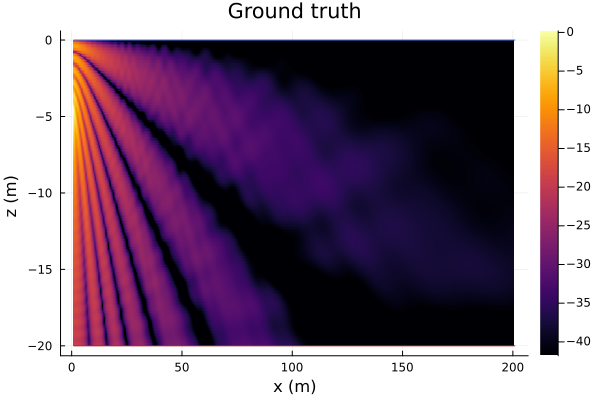

# DataDrivenAcoustics.jl

Conventional acoustic propagation models require accurate environmental knowledge to be available beforehand. While data-driven techniques might allow us to model acoustic propagation without the need for extensive prior environmental knowledge, such techniques tend to be data-hungry. We propose a physics-based data-driven acoustic propagation modeling approach that enables us to train models with only a small amount of data. The proposed modeling framework is not only data-efficient, but also offers flexibility to incorporate varying degrees of environmental knowledge, and generalizes well to permit extrapolation beyond the area where data were collected. 

## Installation

```julia
julia> # press ]
pkg> add UnderwaterAcoustics
pkg> add DataDrivenAcoustics
pkg> # press BACKSPACE
julia> using UnderwaterAcoustics
julia> using DataDrivenAcoustics
julia> models()
5-element Vector{Any}:
 PekerisRayModel
 RayBasis2D
 RayBasis2DCurv
 RayBasis3D
 RayBasis3DRCNN
```

## Available formulations

There are four formulations provided in current package:
| Formulation | Description | Calculation function |
|:-----|:---------|:---------|
| RayBasis2D | 2D plane wave formulation. | RayBasis2DCal |
| RayBasis2DCurv | 2D plane wave formulation by modeling curvature of wavefornt.| RayBasis2DCurvCal|
| RayBasis3D | 3D spherical wave formulation. | RayBasis3DCal |
| RayBasis3DRCNN | 3D spherical wave formulation with reflection coefficient neural network (RCNN) as part of the model. | RayBasis3DRCNNCal |


## Usage

`DataDrivenUnderwaterEnvironment` creates a data driven environment.
- `locations`: location measurements (in the form of matrix with dimensions [dimension of single location data x number of data points])
- `measurements`: acoustic field measurements (in the form of matrix with dimensions [1 x number of data points])
- `soundspeed`: medium sound speed (default: missing)
- `frequency`: source frequency (default: missing)
- `waterdepth`: water depth(default: missing)
- `salinity`: water salinity (default: 35)
- `seasurface`: surface property (dafault: Vacuum)
- `seabed`: seabed property (default: SandySilt)
-`tx`: source location (default: missing)


`ModelTrainingSetting` contains parameters related to model training setups.
- `ini_lr`: initial learning rate. User needs to specify this value
- `trainloss`: loss function used in training and model update
- `dataloss`: data loss function to calculate benchmarking validation error for early stopping
- `ratioₜ`:data split ratio = number of training data / (number of training data + number of validation data) (default: 0.7)
- set `seed` to true to seed random data selection order (default: false)
- `maxepoch`: maximum number of training epoches allowed (default: 10000000)
- `ncount`: maximum number of tries before reducing learning rate (default: 5000)
-  model training ends once learning rate is smaller than `minlearnrate` (default: 1e-6)
- learning rate is reduced by `reducedlearnrate` once `ncount` is reached (default: 10) 
- set`showloss` to true to show  training and validation errors while training the model (default: false)  


`RayBasis2D`: 2D plane wave formulation. This formulation does not require knowledge of channel geometry.
- `env`: data driven underwater environment
- `trainsettings`: model training setups
- `calculatefield`: function to calculate acoustic field (default: RayBasis2DCal)
- `nrays`: number of rays (default: 60)
- `θ`: azimuthal angle of arrival rays in radian (default: missing)
- `A`: amplitude of arrival rays (default: missing)
- `ϕ`: phase of a rays in radian (default: missing)
- `k`: angular wavenumber in rad/m (default: missing)
- `trainable`: trainable parameters (default: empty)

`RayBasis2DCurv`: 2D formulation by modeling curvature of wavefornt. This formulation does not require knowledge of channel geometry.
- `env`: data driven underwater environment
- `trainsettings`: model training setups
- `calculatefield`: function to calculate acoustic field (default: RayBasis2DCurvCal)
- `nrays`: number of rays (default: 60)
- `θ`: azimuthal angle of arrival ray in radian (default: missing)
- `A`: amplitude of arrival rays (default: missing)
- `ϕ`: phase of a rays in radian (default: missing)
- `d`: distance in meters to help in modeling curvature of wavefornt (default: missing)
- `k`: angular wavenumber in rad/m (default: missing)
- `trainable`: trainable parameters (default: empty)


`RayBasis3D` 3D spherical wave formulation. 
- `env`: data driven underwater environment
- `trainsettings`: model training setups
- `calculatefield`: function to calculate acoustic field (default: RayBasis3DCal)
- `nrays`: number of rays (default: 60)
- `θ`: nominal azimuthal angle of arrival rays in radian (default: missing)
- `ψ`: nominal elevation angle of arrival rays in radian (default: missing)
- `d`: nominal propagation distance of arrival rays  in meters (default: missing)
- `eθ`: error to nominal azimuthal angle of arrival rays in radian (default: missing)
- `eψ`: error to nominal elevation angle of arrival rays in radian (default: missing)
- `ed`: error to nominal propagation distance of arrival rays in meters (default: missing)
- `A`: amplitude of arrival rays (default: missing)
- `ϕ`: phase of a rays in radian (default: missing)
- `k`: angular wavenumber in rad/m (default: missing)
- `trainable`: trainable parameters (default: empty)


`RayBasis3DRCNN`: 3D spherical wave formulation with reflection coefficient neural network (RCNN) as part of the model. This formulation requires knowledge of channel geometry to precalculate nominal ray arrival directions, propagation distance and incident angles.
- `env`: data driven underwater environment
- `trainsettings`: model training setups
- `RCNN`: neural network to model seabed reflection coefficient 
- `calculatefield`: function to calculate acoustic field (default: RayBasis3DRCNNCal)
- `nrays`: number of rays (default: 60)
- `eθ`: error to nominal azimuthal angle of arrival rays in radian (default: missing)
- `eψ`: error to nominal elevation angle of arrival rays in radian (default: missing)
- `ed`: error to nominal propagation distance of arrival rays in meters (default: missing)
- `k`: angular wavenumber in rad/m (default: missing)
- `trainable`: trainable parameters (default: empty)

**Example:**
If you have a set of measured pressure amplitudes and their corresponding measurement locations as training and validation data, you can directly load them. The location data should be a matrix with dimensions [dimension of single location data x number of data points]. The field data should be a matrix with dimensions [1 x number of data points].

Alternatively, you have the option to utilize the propagation models available in _Undertwateracoustic.jl_, _AcousticRayTracers.jl_ or _AcousticsToolbox.jl_ to generate synthetic acoustic data. 

Here, we use PekerisRayModel to generate synthetic acoustic measurements and ground truth fields within an area of interest:

```julia
julia> using UnderwaterAcoustics
julia> using DataDrivenAcoustics
julia> using Plots

julia> env = UnderwaterEnvironment();
julia> pm = PekerisRayModel(env, 7);
```

We assume an omnidirectional 1 kHz transmitter `tx` at a depth of 5 m at the origin. We sample modeled acoustic from the 7-rays PekerisRayModel `pm` at 500 random locations using `modelfield`. The 500 measurements are used to train our physics-based data-driven propagation model. 

```julia
julia> TX = [0.0, -5.0];
julia> RX = rand(2, 500) .* [100.0, -20.0] .+ [1.0, 0.0];
julia> TL = modelfield(RX, TX, 1000.0, pm);
```

To plot measurement locations on top of ground truth field pattern:

```julia
tx = AcousticSource(0.0, -5.0, 1000.0);
rx = AcousticReceiverGrid2D(1.0, 0.1, 1000, -20.0, 0.1, 200)
tl = transmissionloss(pm, tx, rx)
plot(env; receivers = rx, transmissionloss = tl, title = "Ground truth")
scatter!(RX[1,:], RX[2,:], markersize = 1.5, markercolor =:green, markerstrokewidth = 0)
```


Now you can define a data-driven underwater environment by providing locations, measurements and any known environmental parameters as inputs:

```julia
julia> dataenv = DataDrivenUnderwaterEnvironment(RX, TL; frequency = 1000.0, soundspeed = 1540.0);

julia> models(dataenv)
2-element Vector{Any}:
 RayBasis2D
 RayBasis2DCurv
```

You need to formulate a ray basis neural network (RBNN) model that best suits the given scenario. Currently, this package offers four predefined RBNN formulations, as mentioned earlier. However, users have the flexibility to define their own RBNN formulations tailored to the specific environment. As an illustrative example, we utilize the RayBasis2DCurv formulation.

```julia
julia> datapm = RayBasis2DCurv(dataenv, ModelTrainingSetting(0.005, rmseloss, rmseloss));
``` 
This line of code automates the search and random initialization for trainable parameters of the defined RBNN model, allowing the model to learn from data and return a model with optimized trainable parameters.

To query field at an unvisited location, simply call the trained RBNN model `datapm` with a location coordinate:
```julia
julia> transmissionloss(datapm, AcousticReceiver(50.0, -10.0))
1×1 Matrix{Float64}:
 30.585238723413912
```

You can plot the estimated field patterns in area of interest:
```julia
julia> x = transmissionloss(datapm, rx)
julia> plot(env; receivers = rx, transmissionloss = x, title = "Estimation", clim = (-42, -0))
```


You can ask for a list of significant arrivals[^1]:
```julia
julia> arrivals(datapm, AcousticReceiver(50, -10))

47×2 DataFrame
 Row │ Amplitude  Phase      
     │ Float64    Float64    
─────┼───────────────────────
   1 │  -33.748    0.531266
   2 │  -34.4891  -0.869176
   3 │  -35.6293   0.735562
   4 │  -35.8654   1.48627
   5 │  -36.7292  -1.54892
  ⋮  │     ⋮          ⋮

  42 │  -54.2553   2.90256
  43 │  -54.7527  -1.81664
  44 │  -55.8176  -0.248839
  45 │  -58.9585   2.71384
  46 │  -61.2852  -0.259114
  47 │  -63.6387  -1.44559
```
[^1]: Significant arrivals refers to arrivals with amplitudes exceeding maximum arrival amplitude minus a threshold. Threshold is a keyword argument in `arrivals` and its default value is set to 30dB.


Our proposed physics-based data-driven propagation modeling technique has the capability to extrapolate fields in areas where no measurements have been taken. The region that ranging from 100 m to 200 m is extrapolated from the trained model `datapm`.




## Publications
### Primary paper

- K. Li and M. Chitre, “Data-aided underwater acoustic ray propagation modeling,” 2022. [Online]. Available: https://arxiv.org/abs/2205.06066

### Other useful papers

- K. Li and M. Chitre, “Ocean acoustic propagation modeling using scientific machine learning,” in OCEANS: San Diego–Porto. IEEE, 2021, pp. 1–5.

- K. Li and M. Chitre, “Physics-aided data-driven modal ocean acoustic propagation modeling,” in International Congress of Acoustics, 2022.
