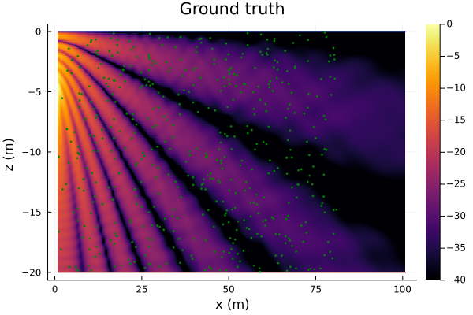
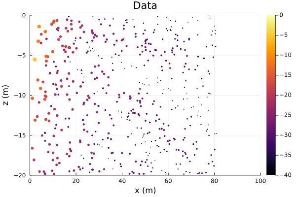
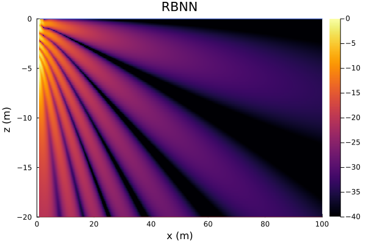
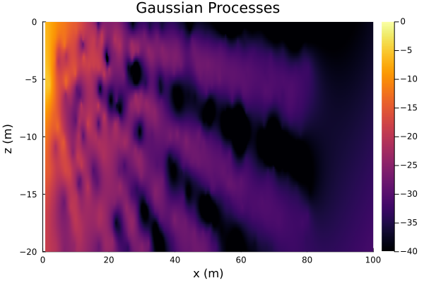

# DataDrivenAcoustics.jl

This package is built upon the ideas discussed in our journal paper "Data-Aided Underwater Acoustic Ray Propagation Modeling" published on IEEE Journal of Oceanic Engineering (available online: https://ieeexplore.ieee.org/abstract/document/10224658).


Conventional acoustic propagation models require accurate environmental knowledge to be available beforehand. While data-driven techniques might allow us to model acoustic propagation without the need for extensive prior environmental knowledge, such techniques tend to be data-hungry. We propose a physics-based data-driven acoustic propagation modeling approach that enables us to train models with only a small amount of data. The proposed modeling framework is not only data-efficient, but also offers flexibility to incorporate varying degrees of environmental knowledge, and generalizes well to permit extrapolation beyond the area where data were collected.


## Installation

```julia
julia> # press ]
pkg> add UnderwaterAcoustics
pkg> add DataDrivenAcoustics
pkg> # press BACKSPACE
julia> using UnderwaterAcoustics
julia> using DataDrivenAcoustics
julia> models()
6-element Vector{Any}:
PekerisRayModel
RayBasis2D
RayBasis2DCurv
RayBasis3D
RayBasis3DRCNN
GPR
```

## Available models

There are five data-driven models provided in current package:
| Model | Description | Calculation function |
|:-----|:---------|:---------|
| `RayBasis2D` | 2D plane wave formulation. | `RayBasis2DCal` |
| `RayBasis2DCurv` | 2D plane wave formulation by modeling curvature of wavefront.| `RayBasis2DCurvCal`|
| `RayBasis3D` | 3D spherical wave formulation. | `RayBasis3DCal` |
| `RayBasis3DRCNN` | 3D spherical wave formulation with reflection coefficient neural network (RCNN) as part of the model. | `RayBasis3DRCNNCal` |
| `GPR` | Gaussian process regression model (2D & 3D) | `GPRCal` |

## Usage

`DataDrivenUnderwaterEnvironment` creates a data-driven environment.
- `locations`: location measurements (in the form of matrix with dimension [dimension of a single location data x number of data points])
- `measurements`: acoustic field measurements (in the form of matrix with dimension [1 x number of data points])
- `soundspeed`: medium sound speed (default: missing)
- `frequency`: source frequency (default: missing)
- `waterdepth`: water depth (default: missing)
- `salinity`: water salinity (default: 35.0)
- `seasurface`: surface property (default: Vacuum)
- `seabed`: seabed property (default: SandySilt)
- `tx`: source location (default: missing)
- set `dB` to `false` if `measurements` are not in dB scale (default: `true`)


`RayBasis2D`: 2D plane wave formulation. This formulation does not require knowledge of channel geometry.
- `env`: data-driven underwater environment
- `calculatefield`: function to estimate acoustic field (default: `RayBasis2DCal`)
- `nrays`: number of rays (default: 60)
- `θ`: azimuthal angle of arrival rays in radian (default: missing)
- `A`: amplitude of arrival rays (default: missing)
- `ϕ`: phase of a rays in radian (default: missing)
- `k`: angular wavenumber in rad/m (default: missing)
- `trainable`: trainable parameters (default: empty)

`RayBasis2DCurv`: 2D formulation by modeling curvature of wavefront. This formulation does not require knowledge of channel geometry.
- `env`: data-driven underwater environment
- `calculatefield`: function to estimate acoustic field (default: `RayBasis2DCurvCal`)
- `nrays`: number of rays (default: 60)
- `θ`: azimuthal angle of arrival ray in radian (default: missing)
- `A`: amplitude of arrival rays (default: missing)
- `ϕ`: phase of a rays in radian (default: missing)
- `d`: distance in meters to help in modeling curvature of wavefront (default: missing)
- `k`: angular wavenumber in rad/m (default: missing)
- `trainable`: trainable parameters (default: empty)


`RayBasis3D`: 3D spherical wave formulation. This formulation allow user to incorporate known channel geometry knowledge by inputting pre-calculated `θ`, `ψ` and `d`. To exclude the error terms from the trainable parameters, set `eθ`, `eψ`, and `ed` to zero if the input values of `θ`, `ψ`, and `d` are accurate.
- `env`: data-driven underwater environment
- `calculatefield`: function to estimate acoustic field (default: `RayBasis3DCal`)
- `nrays`: number of rays (default: 60)
- `θ`: nominal azimuthal angle of arrival rays in radian (default: missing)
- `ψ`: nominal elevation angle of arrival rays in radian (default: missing)
- `d`: nominal propagation distance of arrival rays  in meters (default: missing)
- `eθ`: error to nominal azimuthal angle of arrival rays in radian (default: missing)
- `eψ`: error to nominal elevation angle of arrival rays in radian (default: missing)
- `ed`: error to nominal propagation distance of arrival rays in meters (default: missing)
- `A`: amplitude of arrival rays (default: missing)
- `ϕ`: phase of a rays in radian (default: missing)
- `k`: angular wavenumber in rad/m (default: missing)
- `trainable`: trainable parameters (default: empty)


`RayBasis3DRCNN`: 3D spherical wave formulation with reflection coefficient neural network (RCNN) as part of the model. This formulation requires knowledge of channel geometry (water depth and source location) to pre-calculate nominal ray arrival directions, propagation distances and incident angles. This formulation currently only supports flat bathymetry.
- `env`: data-driven underwater environment
- `RCNN`: neural network to model seabed reflections 
- `calculatefield`: function to estimate acoustic field (default: `RayBasis3DRCNNCal`)
- `nrays`: number of rays (default: 60)
- `eθ`: error to nominal azimuthal angle of arrival rays in radian (default: missing)
- `eψ`: error to nominal elevation angle of arrival rays in radian (default: missing)
- `ed`: error to nominal propagation distance of arrival rays in meters (default: missing)
- `k`: angular wavenumber in rad/m (default: missing)
- `trainable`: trainable parameters (default: empty)


These four physics-based data-driven propagation models have optional arguments pertaining to model training setups, in addition to the previously explained model parameters.
- `ini_lr`: initial learning rate (default: 0.001)
- `trainloss`: loss function used in model training (default: `rmseloss`)
- `dataloss`: data loss function to calculate benchmarking validation error for early stopping (default: `rmseloss`)
- `ratioₜ`: data split ratio = $\frac{\text{number of training data}}{\text{number of training data + number of validation data}}$ (default: 0.7)
- set `seed` to `true` to seed random data selection order (default: `false`)
- `maxepoch`: maximum number of training epochs allowed (default: 10000000)
- `ncount`: maximum number of attempts without data loss improvement before reducing the learning rate (default: 5000)
-  model training ends once learning rate is smaller than `minlearnrate` (default: 1e-6)
- learning rate is reduced by `reducedlearnrate` once `ncount` is reached (default: 10)
- set `showloss` to true to display training and validation errors during the model training process, if the validation error is historically the best. (default: `false`)


`GPR`: Gaussian process regression model that is capable of handling 2D and 3D regression problems.
- `env`: data-driven underwater environment
- `kern`: kernel function
- `mZero`: zero mean function (default: `MeanZero()`)
- `logObsNoise`: log standard deviation of observation noise (default: -2.0) 
- `ratioₜ`: training data split ratio (default: 1.0)
- set `seed` to `true` to seed random data selection order (default: `false`)
- `calculatefield`: function to estimate acoustic field (default: `GPRCal`) 


**Example:**
If you have a set of measured pressure amplitudes and their corresponding measurement locations as training and validation data, you can load them directly. The location data should be a matrix with dimension [dimension of a single location data x number of data points]. The field data should be a matrix with dimension [1 x number of data points].

Alternatively, you can use the propagation models available in `Undertwateracoustic.jl`, `AcousticRayTracers.jl` or `AcousticsToolbox.jl` to generate synthetic acoustic data.

Here, we use a  7-rays `PekerisRayModel` to generate synthetic acoustic measurements and ground truth fields within an area of interest and an extended region:
```julia
julia> using UnderwaterAcoustics
julia> using DataDrivenAcoustics

julia> env = UnderwaterEnvironment();
julia> pm = PekerisRayModel(env,7);
```

We assume an omnidirectional 1 kHz transmitter `tx` at a depth of 5 m at the origin. We sample modeled acoustic measurements `tloss` from `pm` at 500 random locations `rxpos` covering an 80 m x 20 m area of interest. Those 500 measurements are used to train our physics-based data-driven propagation model. We seed the random generator to allow reader replicate the following results[^1].
[^1]: The presented results are obtained using Apple M2 chip with Julia version 1.7.3.
```julia
julia> using Random
julia> Random.seed!(1);
julia> txpos = [0.0, -5.0]; #source location
julia> f = 1000.0; #frequency at 1kHz
julia> tx = AcousticSource(txpos[1], txpos[2], f); #define a source in UnderwaterAcoustics.jl
julia> rxpos = rand(2, 500) .* [80.0, -20.0] .+ [1.0, 0.0]; #random receiver locations in area of interest
julia> tloss = Array{Float32}(undef, 1, size(rxpos)[2]);
julia> for i in 1 : 1 : size(rxpos)[2]
          tloss[1, i] = Float32(transmissionloss(pm, tx, AcousticReceiver(rxpos[1,i], rxpos[2,i]); mode=:coherent))
       end
```

We plot measurement locations on top of ground truth field pattern. Note that the region from a range of 80 m to 100 m is the extended region where no measurement data are taken.

```julia
julia> using Plots
julia> rx = AcousticReceiverGrid2D(1.0, 0.1, 1000, -20.0, 0.1, 200);
julia> let x = transmissionloss(pm, tx, rx)
          plot(env; receivers = rx, transmissionloss = x, title = "Ground truth", clim = (-40,0))
          scatter!(rxpos[1,:], rxpos[2,:]; markersize = 1.5, markercolor =:green, markerstrokewidth = 0)
          xlims!(0, 100)
          ylims!(-20, 0)
        end
```


We plot the measurement locations with scaled size and color for better visualization:
```julia 
julia> let s = clamp.(vec(-tloss) ./ 40 .+ 1, 0.0, 1.0) .* 4 .+ 1
          plot(rxpos[1,:], rxpos[2,:]; zcolor = vec(-tloss), seriestype=:scatter, clim = (-40, 0), markersize = s, markerstrokewidth = 0, label = nothing, title = "Data", xlabel = "x (m)", ylabel = "z (m)")
          xlims!(0, 100)
          ylims!(-20, 0)
      end
```



Now you can define a data-driven underwater environment by providing locations, measurements and any known environmental or geometric parameters as inputs:

```julia
julia> dataenv = DataDrivenUnderwaterEnvironment(rxpos, tloss; frequency = f, soundspeed = 1540.0);
```

You need to formulate a ray basis neural network (RBNN) model that best suits the given scenario. Currently, this package offers four predefined RBNN formulations, as mentioned earlier. There are three data-driven models capable of handing this specific environment `dataenv`:
```julia
julia> models(dataenv)
3-element Vector{Any}:
RayBasis2D
RayBasis2DCurv
GPR
```

Users have the flexibility to define their own RBNN formulations tailored to the specific environment. As an illustrative example, we utilize the RayBasis2DCurv formulation.

```julia
julia> datapm = RayBasis2DCurv(dataenv; inilearnrate = 0.005, seed = true);
```
This line of code automates the search and random initialization for trainable parameters of the defined RBNN model, allowing the model to learn from data and return a model with optimized trainable parameters.

To query field at an unvisited location, simply call the `transmissionloss` with trained RBNN model `datapm` and a location coordinate:
```julia
julia> transmissionloss(datapm, nothing, AcousticReceiver(50.0, -10.0))
 30.47255541988299
```
Note that source location is optional in transmission loss calculation for data-driven propagation models.


You can plot the estimated field patterns within the area of interest and the extended region:
```julia
julia> let x = transmissionloss(datapm, nothing, rx)
          plot(env; receivers = rx, transmissionloss = x, title = "RBNN", clim = (-40,0))
          xlims!(0, 100)
          ylims!(-20, 0)
       end
```


Our proposed physics-based data-driven propagation modeling technique has the capability not only to interpolate but also to extrapolate.


You can ask for the significant arrivals[^2]:
```julia
julia> arrivals(datapm, nothing, AcousticReceiver(50, -10))
56-element Vector{DataDrivenAcoustics.RayArrival{Missing, ComplexF64}}:
                         |          | -33.9 dB ϕ -68.6°
                         |          | -34.3 dB ϕ-146.7°
                         |          | -36.0 dB ϕ 155.4°
                         |          | -36.4 dB ϕ -51.1°
                         |          | -36.9 dB ϕ -29.0°
                         |          | -37.0 dB ϕ -88.1°
 ⋮
                         |          | -60.6 dB ϕ 152.6°
                         |          | -62.5 dB ϕ -88.7°
                         |          | -62.5 dB ϕ  55.4°
                         |          | -62.6 dB ϕ -57.2°
                         |          | -62.7 dB ϕ-169.1°
```
The empty columns represent information that is not provided by data-driven models.

[^2]: Significant arrivals refer to arrivals with amplitudes no smaller than maximum arrival amplitude minus `threshold`. `threshold` is a optional argument in `arrivals` and its default value is set to 30 dB.


For benchmarking, we construct a Gaussian process regression model using `GPR` given a kernel. To take advantage of the kernels available in the `GaussianProcesses.jl` package, please ensure that you have installed it.

```julia
julia> using GaussianProcesses;
julia> kern = Matern(1/2, 0.0, 0.0);
julia> gp = GPR(dataenv, kern; logObsNoise = -5.0, seed = true, ratioₜ = 1.0);
julia> let x = transmissionloss(gp, nothing, rx)
          plot(dataenv; receivers = rx, transmissionloss = x, clims=(-40,0), title = "Gaussian Processes")
          xlims!(0, 100)
          ylims!(-20, 0)
      end
```


The Gaussian process model can recover key strcuture in field pattern with low fidelity, but fails to extrapolate beyond the measurement region.

Note that we use 100% of the data (500 measurements) as training data to train the GPR model, as the ratioₜ in GPR is set to 1.0 by default. Our RBNN model, on the other hand, is trained using 350 measurements, while the remaining 150 measurements are used as validation data for early stopping. The provided kernel and hyperparameters yield the best estimated field pattern (determined through visual inspection, as we know the ground truth field pattern) among the various kernels and hyperparameters we experimented with for this specific example. If users lack prior information about the ground truth field pattern, they should allocate some validation data for hyperparameter tuning of the GPR model.


## Publications
### Primary paper

- K. Li and M. Chitre, “Data-aided underwater acoustic ray propagation modeling,” 2023. [Online]. Available: https://ieeexplore.ieee.org/abstract/document/10224658

### Other useful papers

- K. Li and M. Chitre, “Ocean acoustic propagation modeling using scientific machine learning,” in OCEANS: San Diego–Porto. IEEE, 2021, pp. 1–5.

- K. Li and M. Chitre, “Physics-aided data-driven modal ocean acoustic propagation modeling,” in International Congress of Acoustics, 2022.


