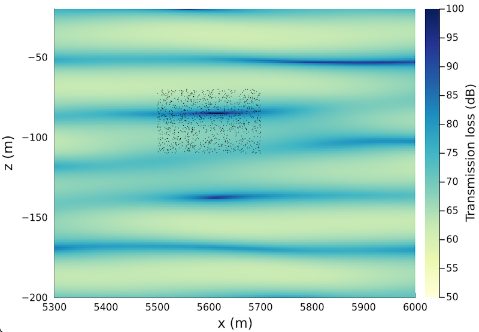
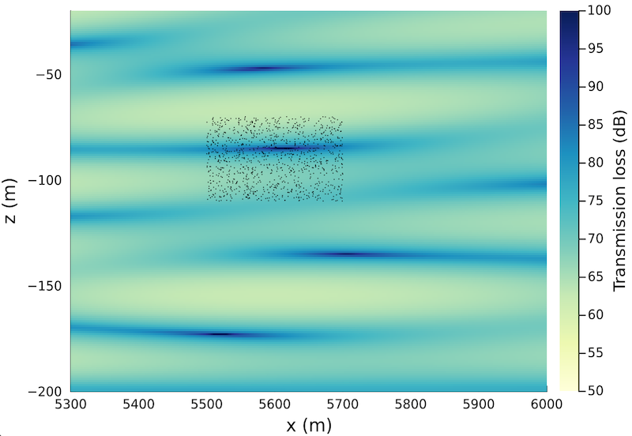

# DataDrivenAcoustics

This package is built upon the ideas discussed in our journal paper "Data-Aided Underwater Acoustic Ray Propagation Modeling" published on IEEE Journal of Oceanic Engineering (available [online](https://ieeexplore.ieee.org/abstract/document/10224658)). It provides a Ray-basis neural network implementation for use with [`UnderwaterAcoustics.jl`](https://github.com/org-arl/UnderwaterAcoustics.jl).

Conventional acoustic propagation models require accurate environmental knowledge to be available beforehand. While data-driven techniques might allow us to model acoustic propagation without the need for extensive prior environmental knowledge, such techniques tend to be data-hungry. We propose a physics-based data-driven acoustic propagation modeling approach that enables us to train models with only a small amount of data. The proposed modeling framework is not only data-efficient, but also offers flexibility to incorporate varying degrees of environmental knowledge, and generalizes well to permit extrapolation beyond the area where data were collected.

> [!NOTE]
> The API for `DataDrivenAcoustics.jl` changed significantly in `v0.3` to align itself with newer versions of `UnderwaterAcoustics.jl`. Some of the functionality from `v0.2` has not yet been ported to `v0.3`, so if you need older functionality, please use `v0.2`. We will add back much of the functionality and more soon!

## Installation

```julia
julia> # press ]
pkg> add UnderwaterAcoustics, DataDrivenAcoustics
```

## Usage

We first start by loading some helpful dependencies:
```julia
using UnderwaterAcoustics
using DataDrivenAcoustics
using StableRNGs
using Plots
```
and then prepare a dataset by sampling transmission loss at 1000 random locations from a `PekerisRayTracer` propagation model:
```julia
env = UnderwaterEnvironment(seabed=Rock, bathymetry=200.0)
pm1 = PekerisRayTracer(env; max_bounces=3)
tx = AcousticSource(0, -11, 250)
rxpos = rand(StableRNG(27), 2, 1000) .* [200.0, 40.0] .+ [5500.0, -110.0]
rxs = [AcousticReceiver(rxpos[1,i], rxpos[2,i]) for i ∈ 1:size(rxpos,2)]
xloss = Float32.(transmission_loss(pm1, tx, rxs))
```
We use a `StableRNG` random number generator for reproducibility of this example. We now have transmission loss data measured at 1000 random locations in a 5.5 to 5.7 km range and 70 to 110 m depth.

We would like to use this data to build a data-driven propagation model:
```julia
pm = DataDrivenPropagationModel(RayBasisNN_2D(60); rng=StableRNG(42))
```
This creates an untrained model, initialized with random weights. We next prepare a loss function that measures the prediction error for the dataset we created:
```julia
rxs = [AcousticReceiver(x, z) for (x, z) ∈ zip(rxpos[1,:], rxpos[2,:])]
loss = TransmissionLossMSE(pm, AcousticSource(nothing, 250), rxs, xloss)
```
Once we have the loss function, we can train the propagation model. We do the training in 2-phases, as is common for physics-guided problems. The first phase uses an `Adam` optimizer to find a good solution:
```julia
DataDrivenAcoustics.fit!(pm, loss;
  optimizer = Adam(5e-6),           # ADAM with specified learning rate
  minloss = 100,                    # minimize until loss < 100
  maxiters = 5000,                  # or until 5000 epochs have passed
  show_progress = 100)              # print progress every 100 epochs
```
The second phase uses a `BFGS` optimizer to refine the solution to a local minimum:
```julia
DataDrivenAcoustics.fit!(pm, loss;
  optimizer = BFGS(),               # BFGS quasi-Newton optimizer
  maxiters = 200,                   # minimize to a maximum of 200 iterations
  show_progress = 1)                # print progress every iteration
```
We can now use the model to predict transmission loss in an area of interest. Note that the model is able to extrapolate well beyond the area where measurements were made (shown as block dots below):
```julia
rx = AcousticReceiverGrid2D(5300:6000, -200:-20)
x = transmission_loss(pm, AcousticSource(nothing, 250), rx)
plot(rx, x; clim=(50,100), xlims=(5300,6000), ylims=(-200,-20))
scatter!([p for p ∈ zip(rxpos[1,:], rxpos[2,:])]; markersize=0.5, color=:black)
```


We compare this with the ground truth from the original physics-based propagation model:
```julia
x = transmission_loss(pm1, tx, rx)
plot(rx, x; clim=(50,100), xlims=(5300,6000), ylims=(-200,-20))
scatter!([p for p ∈ zip(rxpos[1,:], rxpos[2,:])]; markersize=0.5, color=:black)
```


While we see that the match is not perfect, it is pretty impressive given that we have no measurements in the extrapolated area!

## Publications
### Primary paper

- K. Li and M. Chitre, “Data-aided underwater acoustic ray propagation modeling,” 2023. [(online)](https://ieeexplore.ieee.org/abstract/document/10224658)

### Other useful papers

- K. Li and M. Chitre, “Ocean acoustic propagation modeling using scientific machine learning,” in OCEANS: San Diego–Porto. IEEE, 2021, pp. 1–5.
- K. Li and M. Chitre, “Physics-aided data-driven modal ocean acoustic propagation modeling,” in International Congress of Acoustics, 2022.
